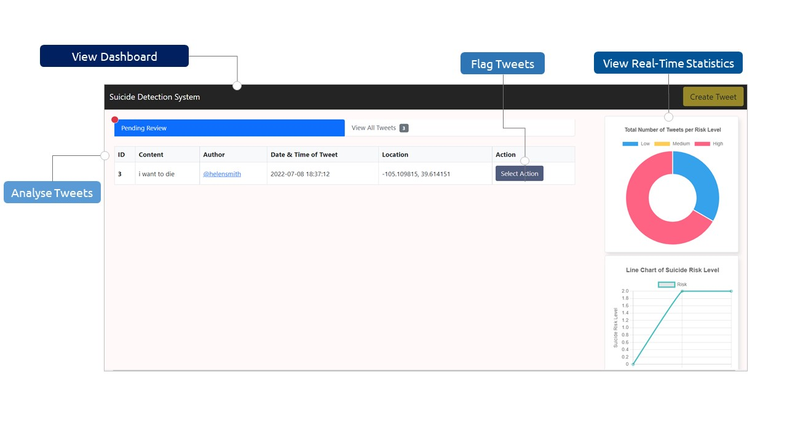
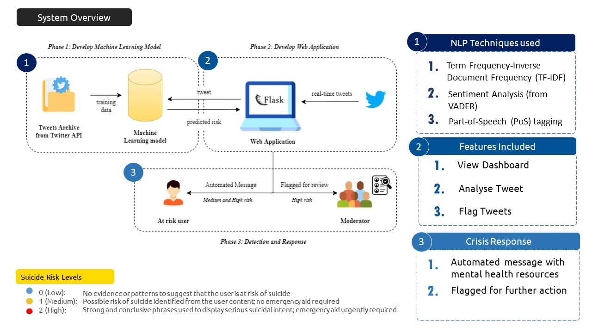

<!--
<!-- PROJECT SHIELDS -->
<!--
*** I'm using markdown "reference style" links for readability.
*** Reference links are enclosed in brackets [ ] instead of parentheses ( ).
*** See the bottom of this document for the declaration of the reference variables
*** for contributors-url, forks-url, etc. This is an optional, concise syntax you may use.
*** https://www.markdownguide.org/basic-syntax/#reference-style-links
-->

<!-- PROJECT LOGO -->
 

  

<h3 align="center">Suicide Ideation Detection and Response system for Textual Social Media Posts</h3>

  

    Social media applications exist as a fundamental medium of communication up to the extent that people treat these platforms as a “safe space” for them to express their suicide tendencies. Unfortunately, this puts social media users and the company themselves at risk of harmful and inappropriate content that threatens the safety of the platform. Hence, this project focuses on developing a comprehensive web application that supports real-time classification of tweets into three suicide risk categories and triggers a tailored crisis response that targets specific suicide risk levels. 
     
    <a href="https://github.com/ameliatheamazin/suicide_detection/tree/main/Images/Project.gif"><strong>View Prototype Demo »</strong></a>
     
     
    <a href="https://ieeexplore.ieee.org/abstract/document/9918782">View Publication</a>
    ·
    <a href="https://github.com/ameliatheamazin/suicide_detection/issues">Report Bug</a>
  

<!-- ABOUT THE PROJECT -->
## About The Project

This project covers the end-to-end activities from model development, which uses Natural Language Processing and feature extraction techniques to improve the model’s classification performance, to its deployment on Flask web application framework for real-time monitoring and detection of tweets, and finally the initiation of proactive responses tailored to specific suicide risk levels.

(<a href="#readme-top">back to top</a>)

### Key Contributions

* Analysis on findings: Presented detailed analysis on the sentiment and linguistic characteristics associated with specific levels of suicide risk, providing increased understanding on how these patterns aid the model in discerning different levels of suicide risk
* Improved model: Developed a trained model for accurate detection of different levels of risk associated with suicide ideation within social media textual posts with an increased performance when benchmarked with related work
* Validated response mechanism: Presented a validated approach towards streamlining the integration of suicide ideation detection and response under a single, fully functional web application for other social media sites to seamlessly integrate this system into their platform

### Development Tools Used

* Backend: Twitter API, Flask, Python (NLTK, Sklearn, Seaborn and Pickle)
* Frontend: Bootstrap, Javascript, HTML

(<a href="#readme-top">back to top</a>)

### System Overview

* First Phase: Preparation of Twitter dataset, model development and training
* Second Phase: Model integration into dynamic web application
* Last Phase: Implementation of automated response for tweets labelled with medium to high risk to receive automated support message; while high risk tweets to be automatically flagged for review by a moderator

(<a href="#readme-top">back to top</a>)

### Key Findings

* Model was able to utilise the linguistic and grammatical patterns found within the sentiment score, TF-IDF and PoS tags to communicate different degrees of suicide ideation
* Choice of words used in context has a direct influence on the sentiment score and TF-IDF. Hence, sufficient context is crucial to provide more information for the model to learn effectively 
* System showed promising results when tested with random samples, which proves ability of the model to generalize unseen data and thus verifies the efficacy of the
system in real-time environment

